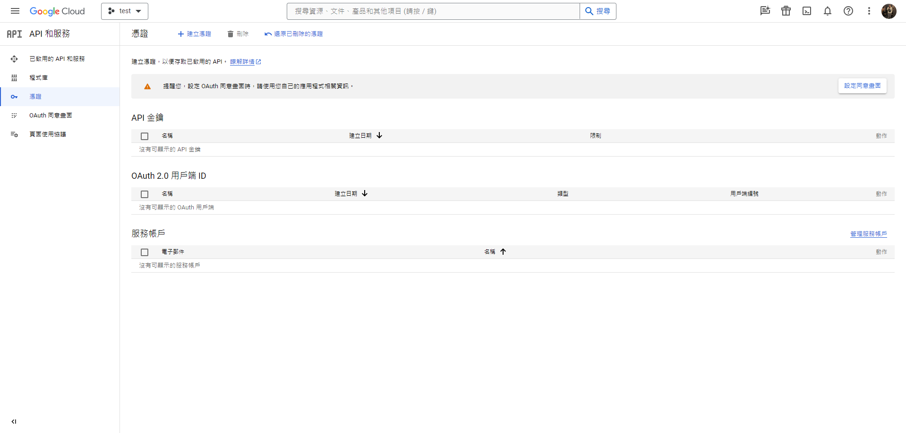
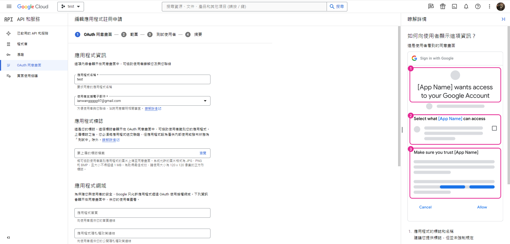
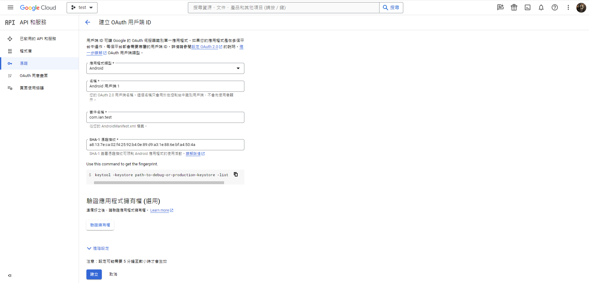
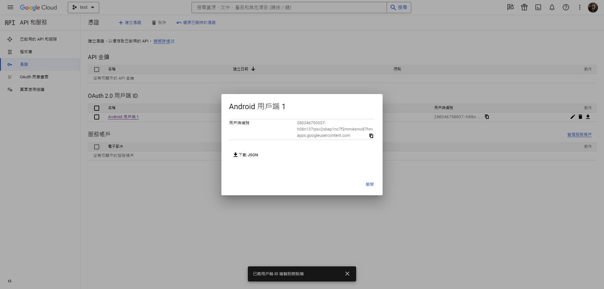

# GoogleLogin without Firebase

### 1. [Google Cloud Platform](https://console.cloud.google.com/?hl=zh-tw) 按照步驟建立新專案，並進入【API和服務】
+ 

### 2. 建立OAuth同意畫面
+ 

### 3. 建立OAuth用戶端ID
+ 應用程式類型選Android
+ 填入APPID與SHA金鑰
+ 如果有上架GooglePlay，則還需要使用Google Play Console應用程式簽署金鑰再建立一個用戶端
+ [怎麼取得SHA金鑰](https://github.com/IanWangIITZDAWG/SHA-key)
+ 

### 4. 將json放到Flutter專案 > ./android/app 中
+ 

### 5. Flutter專案新增【google_sign_in】套件

### 6. 開始使用
+ [查看套件使用方法](https://pub.dev/packages/google_sign_in)
```dart
import 'package:google_sign_in/google_sign_in.dart';

Future<GoogleSignInAccount?> googleLogin(context) async {
  bool isIOS = Theme.of(context).platform == TargetPlatform.iOS;
  GoogleSignIn googleSignIn = GoogleSignIn(
      scopes: [
        'email',
        'https://www.googleapis.com/auth/contacts.readonly',
      ],
      clientId: isIOS
          ? '280346750037-h08n137rpsv2sbep1nc7f2mm4smo87hm.apps.googleusercontent.com'
          : '');
  var googleAccount = await googleSignIn.signIn();
  return googleAccount;
}
```